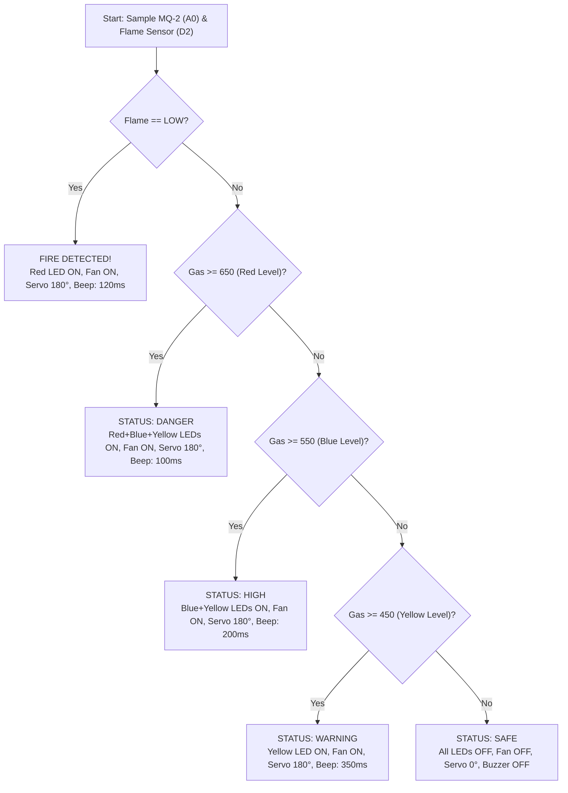

<div align="center">

# 🚨 Gas Leakage and Fire Alert with Prevention System

### An Arduino-Based Embedded Hazard Detection, Automated Ventilation, Gas Shutoff, and IoT Alerting System

[](https://www.arduino.cc/)
[](https://github.com/mhtamim136/gas-leakage-and-fire-alert-with-prevention-system)
[](https://remotexy.com/)
[](https://www.labcenter.com/)
[](https://www.aiub.edu/)

</div>

---

## 📌 Overview

**Gas Leakage and Fire Alert with Prevention System** is an embedded safety solution designed to detect combustible gases (LPG, Butane, Methane, Smoke) and fire outbreaks in domestic, commercial, and laboratory environments. 

Unlike traditional passive detectors that merely sound an alarm, this system provides an **active multi-tier prevention and safety mechanism**:
1. **Multi-Stage Detection:** Continuous sampling using an **MQ-2 gas sensor** and an **infrared flame sensor**.
2. **Audio-Visual Local Alerting:** Multi-color status LEDs (Yellow, Blue, Red), variable-frequency pulsed buzzer alarms, and a real-time **16×2 I2C LCD** screen.
3. **Automated Hazard Mitigation:**
   - **Forced Ventilation:** Automatically powers on a high-speed DC exhaust fan via an **IRFZ44N MOSFET** driver to disperse accumulated gas or smoke.
   - **Gas Cylinder Shutoff:** Automatically turns a **servo motor** to $180^\circ$ to physically close the gas regulator valve, stopping further leakage.
4. **IoT Remote Monitoring:** Employs an **ESP8266 (ESP-01)** Wi-Fi module running **RemoteXY** in Access Point mode to stream real-time sensor levels, LED indicators, and valve state directly to a smartphone.
5. **Cost-Effective & Standalone:** Total prototype cost $\approx 1300\text{ BDT}$ (well within the budget ceiling preferred by over 70% of surveyed domestic users), fully functional without mandatory cloud or internet dependency.

---

## 📋 Table of Contents

- [Visual Showcase & Circuit Diagrams](#-visual-showcase--circuit-diagrams)
- [Key Features](#-key-features)
- [System Architecture & Working Principle](#-system-architecture--working-principle)
- [Hardware Components](#-hardware-components)
- [Pinout & Wiring Diagram](#-pinout--wiring-diagram)
- [Hazard Detection & Threshold Logic](#-hazard-detection--threshold-logic)
- [Proteus Simulation](#-proteus-simulation)
- [Setup & Code Upload Guidelines](#-setup--code-upload-guidelines)
- [Repository Structure](#-repository-structure)
- [Project Documentation](#-project-documentation)
- [Team & Academic Credits](#-team--academic-credits)
- [Author & Contact](#-author--contact)

---

## 📸 Visual Showcase & Circuit Diagrams

### Hardware Prototype

| Hardware Setup (Top View) | Hardware Enclosure & Actuators |
|:---:|:---:|
|  |  |

### Circuit & Simulation Schematics

| Complete Connection Schematic | Proteus Simulation Model |
|:---:|:---:|
|  |  |

---

## ✨ Key Features

- 🧯 **Dual Hazard Monitoring:** Simultaneous detection of gas accumulation (MQ-2) and fire/flame infrared radiation.
- 🔄 **Autonomous Physical Prevention:**
  - **Mechanical Shutoff:** Servo motor rotates to $180^\circ$ to turn off the regulator handle.
  - **Exhaust Ventilation:** DC exhaust fan turns on instantly to evacuate gas and lower concentration below explosive limits.
- 🚨 **Multi-Tiered Warning Levels:**
  - **Safe Level:** Gas $< 450$ ADC; Fan OFF, Valve OPEN ($0^\circ$).
  - **Warning Level:** Gas $\ge 450$ ADC; Yellow LED ON, Fan ON, Valve CLOSED ($180^\circ$), slow buzzer pulse ($350\text{ ms}$).
  - **High Level:** Gas $\ge 550$ ADC; Yellow + Blue LEDs ON, Fan ON, Valve CLOSED, medium buzzer pulse ($200\text{ ms}$).
  - **Danger Level:** Gas $\ge 650$ ADC; Yellow + Blue + Red LEDs ON, Fan ON, Valve CLOSED, rapid buzzer pulse ($100\text{ ms}$).
  - **Fire Detected:** Flame sensor triggered (LOW); Red LED ON, Fan ON, Valve CLOSED, continuous emergency alarm ($120\text{ ms}$).
- 📱 **RemoteXY Smartphone Dashboard:** Connects via ESP8266 Access Point (`SSID: "Arduino"`) to view real-time gas readings, status LEDs, and valve toggle status on Android/iOS.
- 📟 **Real-Time LCD Display:** 16×2 I2C character LCD displays current status (`SAFE`, `WARNING`, `HIGH`, `DANGER`, `FIRE DETECTED`) and exact ADC gas values.
- ⚡ **Non-Blocking Execution:** Uses `millis()`-based timer routines for audio pulsation, ensuring uninterrupted sensor reading and RemoteXY polling.

---

## ⚙️ System Architecture & Working Principle

```
+---------------------+       +------------------------+
|  MQ-2 Gas Sensor    | ----> |                        | ----> 16x2 I2C LCD Display
|  (Analog Pin A0)    |       |                        |
+---------------------+       |                        | ----> Status LEDs (Y, B, R)
                              |   Arduino Uno R3       |
+---------------------+       |   (ATmega328P MCU)     | ----> Active Buzzer (Alerts)
|  IR Flame Sensor    | ----> |                        |
|  (Digital Pin 2)    |       |                        | ----> IRFZ44N MOSFET -> DC Fan
+---------------------+       |                        |
                              |                        | ----> SG90 Servo -> Valve Off
+---------------------+       |                        |
|  ESP8266 (ESP-01)   | <---> |                        | ----> Smartphone (RemoteXY App)
|  (Hardware Serial)  |       +------------------------+
+---------------------+
```

1. **Sense:** The MQ-2 sensor measures gas concentration through variable surface conductivity and feeds an analog voltage to pin `A0`. The flame sensor continuously detects infrared light between $760\text{ nm}$ and $1100\text{ nm}$.
2. **Process:** The Arduino Uno digitizes the analog gas reading ($0\text{–}1023$ ADC) and polls digital pin `2`.
3. **Decide:** Pre-calibrated threshold comparison logic determines the severity category.
4. **Actuate:** If a hazard threshold is exceeded, the Arduino drives:
   - Pin `7` HIGH $\rightarrow$ gates the IRFZ44N MOSFET $\rightarrow$ activates the exhaust fan.
   - Pin `6` PWM $\rightarrow$ rotates the servo motor to $180^\circ$ (gas shutoff position).
   - Pin `8` pulsed $\rightarrow$ triggers the piezo buzzer.
   - I2C Bus $\rightarrow$ updates the LCD with diagnostic details.
   - Serial UART $\rightarrow$ pushes telemetry data to the ESP-01 Wi-Fi module for the RemoteXY app.

---

## 🧰 Hardware Components

| Component | Specification / Model | Quantity | Purpose |
|---|---|:---:|---|
| **Microcontroller** | Arduino Uno R3 (ATmega328P) | 1 | Central controller and processing unit |
| **Gas Sensor** | MQ-2 Gas & Smoke Sensor Module | 1 | Detects LPG, Butane, Methane, Hydrogen, Smoke |
| **Flame Sensor** | Infrared Flame Detector Module (YG1006 sensor) | 1 | Detects fire/open flames via IR emission |
| **Display** | 16×2 Character LCD with I2C Module (PCFC8574, `0x27`) | 1 | Real-time visual status and ADC gas readout |
| **Wi-Fi Module** | ESP8266 ESP-01 | 1 | Wireless AP interface for RemoteXY smartphone app |
| **Servo Motor** | Micro Servo (TowerPro SG90 / standard servo) | 1 | Mechanical actuator to shut off the gas regulator |
| **Exhaust Fan** | 5V / 12V DC Brushless Cooling Fan | 1 | Forced ventilation of leaking gas and smoke |
| **Power MOSFET** | IRFZ44N N-Channel Power MOSFET | 1 | High-current low-side switch for the exhaust fan |
| **Acoustic Buzzer** | 5V Active Piezo Buzzer | 1 | High-decibel audio warning |
| **Indicator LEDs** | 5mm Diffused LEDs (Yellow, Blue, Red) | 3 | Multi-level visual status indication |
| **Resistors** | 220Ω (4 pcs) & 10kΩ (1 pc) | 5 | Current limiting for LEDs/Gate & MOSFET pull-down |
| **Prototyping** | Solderless Breadboard & Jumper Wires | 1 set | Circuit assembly and interconnections |
| **Power Source** | 5V DC regulated power adapter / USB cable | 1 | System electrical supply |

---

## 🔌 Pinout & Wiring Diagram

### Arduino Uno Pin Connections

| Arduino Pin | Connected Component | Function / Signal Type |
|---|---|---|
| **A0** | MQ-2 Gas Sensor `AOUT` | Analog Input (Gas concentration ADC: 0–1023) |
| **D2** | Flame Sensor `DOUT` | Digital Input (Active LOW on fire detection) |
| **D6** | Servo Motor Signal Wire (Orange/Yellow) | PWM Output (Servo angle: $0^\circ$ safe, $180^\circ$ shutoff) |
| **D7** | MOSFET Gate (via 220Ω resistor) | Digital Output (Exhaust fan control) |
| **D8** | Active Buzzer (+) terminal | Digital Output (Audible alert tone) |
| **D11** | Red LED (+) Anode (via 220Ω resistor) | Digital Output (Danger / Fire indicator) |
| **D12** | Blue LED (+) Anode (via 220Ω resistor) | Digital Output (High gas level indicator) |
| **D13** | Yellow LED (+) Anode (via 220Ω resistor) | Digital Output (Warning gas level indicator) |
| **A4 (SDA)** | 16×2 LCD I2C Module `SDA` | I2C Serial Data Bus |
| **A5 (SCL)** | 16×2 LCD I2C Module `SCL` | I2C Serial Clock Bus |
| **D0 (RX)** | ESP8266 Wi-Fi Module `TX` | Hardware Serial Receive (9600 baud) |
| **D1 (TX)** | ESP8266 Wi-Fi Module `RX` (via divider) | Hardware Serial Transmit (9600 baud) |
| **5V / GND** | Power rails across breadboard | Power supply distribution |

---

### 🌪️ MOSFET Fan Driver Connection (Without Flyback Diode)

To handle the inductive load of the DC exhaust fan without overloading the Arduino:

```
[ Arduino Pin D7 ] ---> [ 220Ω Resistor ] ---> [ MOSFET Gate (G) ]
                                                     |
                                              [ 10kΩ Pull-Down ]
                                                     |
                                                  [ GND ]

[ 5V Power Supply ] -------------------------> [ Fan (+) Red Wire ]
[ MOSFET Drain (D) ] <------------------------ [ Fan (-) Black Wire ]
[ MOSFET Source (S)] ------------------------> [ GND ]
```

---

## 📊 Hazard Detection & Threshold Logic

The firmware evaluates conditions sequentially and transitions between states:



| Operating State | Gas ADC (`A0`) | Flame Sensor (`D2`) | LCD Message | LEDs Active | Exhaust Fan | Servo Angle | Buzzer Interval |
|---|:---:|:---:|---|:---:|:---:|:---:|:---:|
| **Safe** | $< 450$ | `HIGH` (Normal) | `STATUS:SAFE` | None | OFF | $0^\circ$ (Open) | Silent |
| **Warning** | $450\text{–}549$ | `HIGH` | `STATUS:WARNING` | Yellow | ON | $180^\circ$ (Closed) | $350\text{ ms}$ |
| **High** | $550\text{–}649$ | `HIGH` | `STATUS:HIGH` | Yellow, Blue | ON | $180^\circ$ (Closed) | $200\text{ ms}$ |
| **Danger** | $\ge 650$ | `HIGH` | `STATUS:DANGER` | Yellow, Blue, Red | ON | $180^\circ$ (Closed) | $100\text{ ms}$ |
| **Fire Hazard** | Any | `LOW` (Flame) | `FIRE DETECTED` | Red | ON | $180^\circ$ (Closed) | $120\text{ ms}$ |

---

## 🧪 Proteus Simulation

A full simulation schematic is provided in [`Proteus_Simulation/Project simulation.pdsprj`](Proteus_Simulation/Project%20simulation.pdsprj):
- Includes custom Proteus library models for the MQ-2 Gas sensor and Flame sensor (`Code/Sensor Library for Proteus.zip`).
- Pre-compiled binary firmware available at `Code/Project_final.ino.standard.hex` for instant testing without recompilation.
- Simulates real-time response: potentiometer adjusts gas concentration, logic state toggles flame sensor, and motor/fan/LCD respond interactively.

---

## 🚀 Setup & Code Upload Guidelines

### Prerequisites & Libraries

Install the following libraries in your **Arduino IDE** (Sketch $\rightarrow$ Include Library $\rightarrow$ Manage Libraries):
1. **RemoteXY** by RemoteXY
2. **LiquidCrystal_I2C** by Frank de Brabander
3. **Servo** (built-in)
4. *Optional for OLED sketch:* **Adafruit SSD1306** & **Adafruit GFX Library**

---

### ⚠️ Critical Note on Code Uploading

> [!IMPORTANT]
> Because the **ESP8266 Wi-Fi module** is connected to Arduino pins `D0 (RX)` and `D1 (TX)`, it shares the hardware UART used by the USB bootloader.
> 
> **Always disconnect either the RX or TX wire of the ESP8266 before clicking Upload in Arduino IDE.**
> Once the code finishes uploading (`Done uploading`), reconnect the wire. Failing to do so will result in `avrdude: stk500_recv(): programmer is not responding` errors.

---

### Step-by-Step Deployment

1. **Assemble Circuitry:** Follow the pinout table and wiring schematics above.
2. **Open Sketch:** Open [`Code/Project_Code.ino`](Code/Project_Code.ino) in Arduino IDE.
3. **Select Board & Port:** Choose **Tools $\rightarrow$ Board $\rightarrow$ Arduino Uno** and the respective COM port.
4. **Upload:** Unplug ESP-01 RX/TX $\rightarrow$ Click **Upload** $\rightarrow$ Replug ESP-01 RX/TX.
5. **Connect Smartphone via RemoteXY:**
   - On your phone, scan for Wi-Fi network: **`Arduino`** (Password: **`12345678`**).
   - Open the **RemoteXY** mobile application.
   - Choose **Add device $\rightarrow$ Wi-Fi Point** (IP `192.168.4.1`, Port `6377`).
   - Monitor real-time gas graphs, warning lights, and valve controls directly from your phone!

---

## 📁 Repository Structure

```
gas-leakage-and-fire-alert-with-prevention-system/
│
├── Code/                                       # Firmware source codes
│   ├── Project_Code.ino                       # Full production code (LCD + RemoteXY + Servo + Fan)
│   ├── FinalOne.ino                           # 115200 baud variant for high-speed ESP serial
│   ├── Project_final.ino                      # Lightweight variant with SSD1306 OLED display
│   ├── Project_final.ino.standard.hex         # Compiled Intel HEX file for Proteus simulation
│   └── Sensor Library for Proteus.zip         # Proteus simulation models for MQ-2 & Flame sensor
│
├── Project_Documents/                          # Project documentation and reports
│   ├── MAES_H_G07_Project_report.docx         # Comprehensive academic project report
│   ├── MAES_H_G7_Project_PPT.pptx             # Official capstone project presentation slides
│   ├── Project proposal.pdf                   # Initial project proposal & survey findings
│   └── Notes/
│       └── fan & Wifi Connection.txt          # Technical notes for MOSFET fan wiring & upload tips
│
├── Proteus_Simulation/                         # Hardware simulation project
│   └── Project simulation.pdsprj              # Complete Proteus 8 schematic & simulation environment
│
├── Screenshots/                                # Visual assets and hardware proof
│   ├── 01_Connection_Diagram.jpg              # Full system circuit schematic
│   ├── 02_Proteus_Simulation.png              # Interactive Proteus simulation snapshot
│   ├── 03_Hardware_Project_Setup_1.png        # Physical prototype setup overview
│   └── 04_Hardware_Project_Setup_2.png        # Close-up of sensors, actuators, and display
│
└── README.md                                  # Repository documentation
```

---

## 📄 Project Documentation

Comprehensive academic documentation and presentation materials are included:

- 📑 [**Download Full Project Report (DOCX)**](Project_Documents/MAES_H_G07_Project_report.docx)
- 📊 [**Download Project Presentation (PPTX)**](Project_Documents/MAES_H_G7_Project_PPT.pptx)
- 📝 [**Download Project Proposal (PDF)**](Project_Documents/Project%20proposal.pdf)
- 💡 [**Technical Wiring Notes (TXT)**](Project_Documents/Notes/fan%20%26%20Wifi%20Connection.txt)

---

## 👥 Team & Academic Credits

This capstone project was completed under the **Department of Electrical and Electronic Engineering (EEE)** / **Faculty of Engineering** at **American International University-Bangladesh (AIUB)**.

- **Course:** Microprocessor and Embedded Systems (`COE3104`), Section `H`
- **Semester:** Spring 2025–2026
- **Course Instructor:** Debraj Das
- **Group:** 07

### Group Members:
| Member Name | Student ID | Academic Degree |
|---|:---:|---|
| **Md. Murad Hasan** *(Lead)* | `23-55559-3` | B.Sc. in Computer Science and Engineering (CSE), AIUB |
| **Maruf Ahammed** | `23-54391-3` | B.Sc. in Computer Science and Engineering (CSE), AIUB |
| **Abdul Al Bari Kyieash** | `23-52851-2` | B.Sc. in Computer Science and Engineering (CSE), AIUB |
| **Md. Mokammel Hossain Remon** | `23-54477-3` | B.Sc. in Computer Science and Engineering (CSE), AIUB |
| **Md Hridoy Mia** | `23-51001-1` | B.Sc. in Computer Science and Engineering (CSE), AIUB |

---

## 👨‍💻 Author & Contact

<div align="center">

### Murad Hasan Tamim

*Computer Science & Engineering Student | Embedded Systems & Full-Stack Developer*

[](https://mhtamim136.github.io)
[](https://mhtamim136.github.io/profile-card/)
[](https://github.com/mhtamim136)

> 💬 Have questions or want to collaborate? Feel free to reach out via my portfolio website or connect on GitHub!

</div>

---

<div align="center">

⭐ **If you found this project helpful or insightful, please consider giving it a star!** ⭐

</div>
